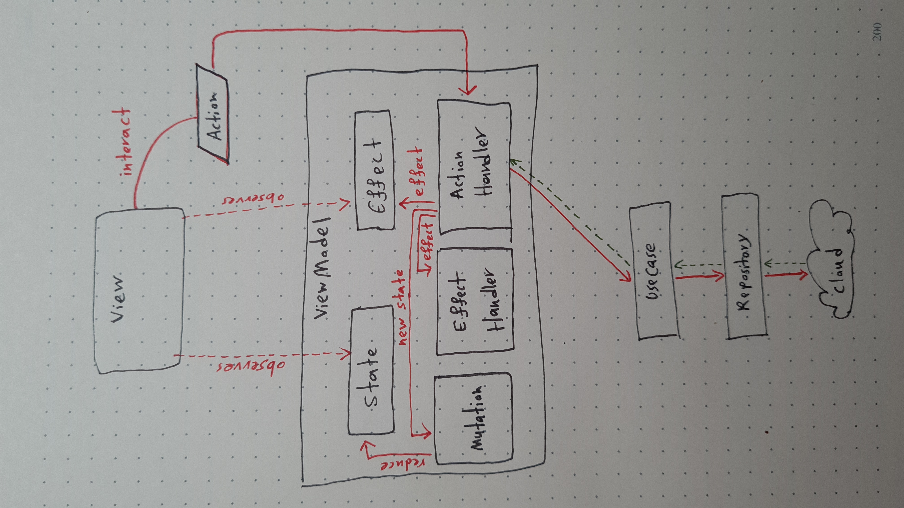

# Music App Challenge

This is the test challenge from DoubleSymmetry, All two (Lazy-load, Search) functionality have been implemented.

Here is the short preview Gif of the app functionalities:

## Let's talk about the details
Unlike the task size which is small, I decided to imagine that this is a peace of scalable app so I choose to use my best at modularity, architecture, and build time optimization aspects.

Here are all the technology and third-party libraries that I used in the project. I put some explanation about each of them on its side.

- ### Clean architecture

  Unlike the traditional DDD pattern, a bad implementation of the clean architecture is not scalable for android projects regarding the build time bottleneck. so I decided to optimize it and move the data flow inside each feature to make them completely independent and also capable to share the required codebase with others.

- ### Gradle optimization

  I enabled the `configuration-cache`, `build-cache` and `parallelism` in gradle `7.2.1` to make it able to finish the compilation very faster than before.

- ### MVI architecture

   Providing an easy-to-use and scalable MVI architecture for Compose & Compose Navigation is a little bit annoying, so I created a complete architectural codebase that created specificly designed for Compose and Compose Navigation that makes it easy and customizable.
This architecture has ability to connect feature routes together without any circular dependency issue and build-cache invalidation issue(by using Impl/api)
Here is the architecture diagram.

  

- ### Coroutines + Flow
- ### Jetpack Compose + Compose Navigation
- ### Material Components + `design-system` Module
- ### Hilt
- ### Coil
- ### Retrofit + Moshi

### Note
- The design had some dimension issues which I optimized it for DP dimensions in app.
